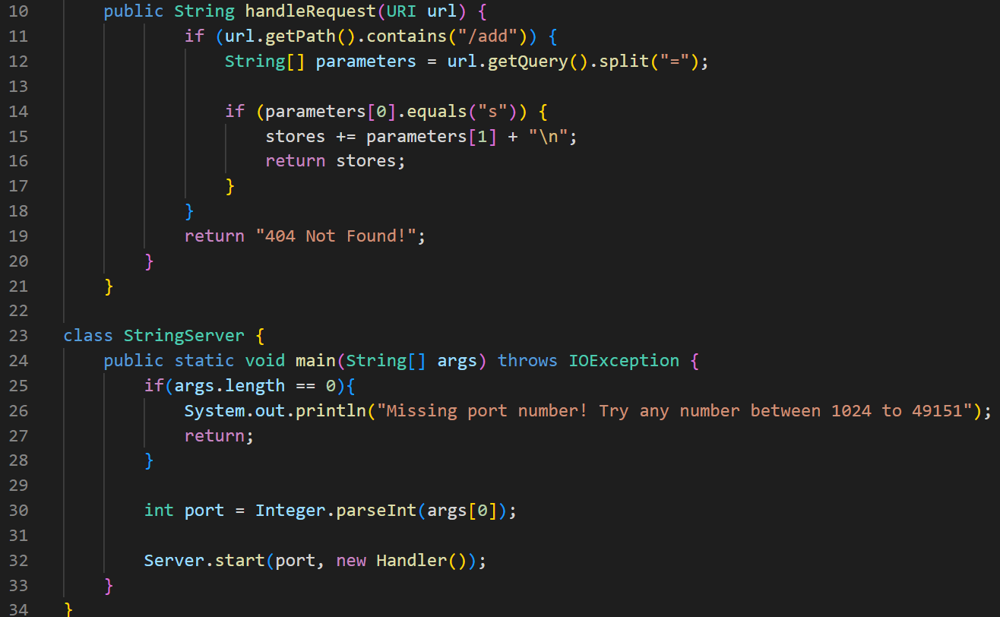
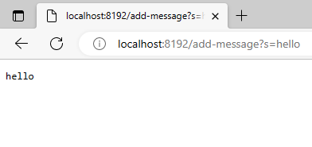
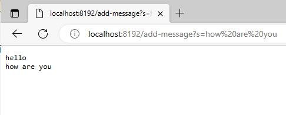

# Lab Report 2: Ruben A Gonzalez
---
**Part 1**
Below is the code used to run StringServer.

After typing a String such as hello in /add-message?s=hello The website will refresh the text...

For this method we are checking to see if the path contains "/add" and "=". If so we can print what is typed after = .

If you were to type /add-message?s=how are you ... You'll see hello /n how are you ... in the website.

---
**Part 2.**
- A failure-inducing input I found in Lab 3 would be inside the file LectureExamples.java. I noticed that method sumEvebIndices has a
bug that would not add the evens correctly.
- An input that doesn't include a failure as a JUnit test can be seen in Tester ArrayTest.java. When the input in testReversed is null there is no way to detect if there's an error with the reverse method.
-
---
**Part 3.** After doing lab 2 and 3 I felt that I was able to learn more about how to start a web server using Github Desktop, and VSCode. My understanding of github has also improved.
